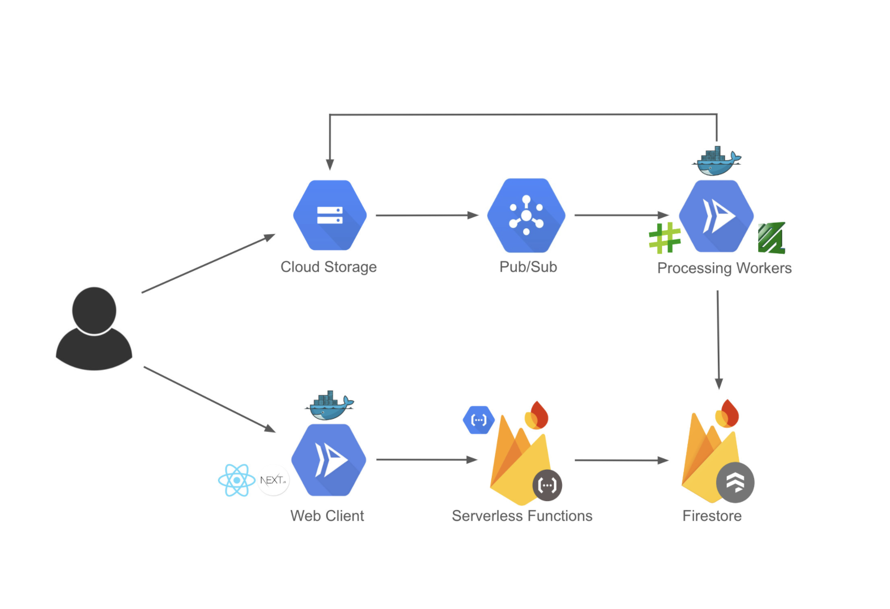

# Video Processing & Streaming App
A deployed microservice architecture for a video streaming app using Next.js, Docker, Google Cloud, and Firebase Functions. Leveraging a message queue (Pub/Sub) for event-driven async processing, FFmpeg for video transcoding, and Firestore for managing metadata.

## Uploading Video Flow:
1. Signed-in users upload videos via Next.js. A Firebase function generates a signed URL for Google Cloud, allowing the video to be uploaded to the ‘raw videos’ bucket.

2. Once the video is uploaded to the ‘raw videos’ bucket, Pub/Sub triggers a message to Cloud Run for video processing.

3. The video processing worker uses FFmpeg to transcode the video and updates Firestore with its status as 'processing.' If Pub/Sub doesn’t get an acknowledgment within 600s(max limit), it retries. To prevent duplication, it only processes new videos. 
    - To preserve idempotent behavior, when a video is ready for processing, some meta data is written to firestore to reflect the status of the video as ‘processing’. Only if the video is a new video will pub/sub be notified otherwise its assumed the video is processing and the message can be voided.
    > If a video fails processing, it's status in firestore is reset to the initial state so Pub/Sub can requeue the message.

4. After processing, the video is uploaded to the ‘processed videos’ bucket, and Firestore is updated to reflect its completion.

## Watching Videos Flow:
1. Any user, whether they are authenticated can watch videos by requesting them via a rest endpoint from firebase functions. Metadata like the videoID is requested from firestore to lookup the public url for the video in the ‘processed videos’ bucket in Cloud Storage.

2. The user can watch the video directly from Cloud Storage which is sent over in streams.
